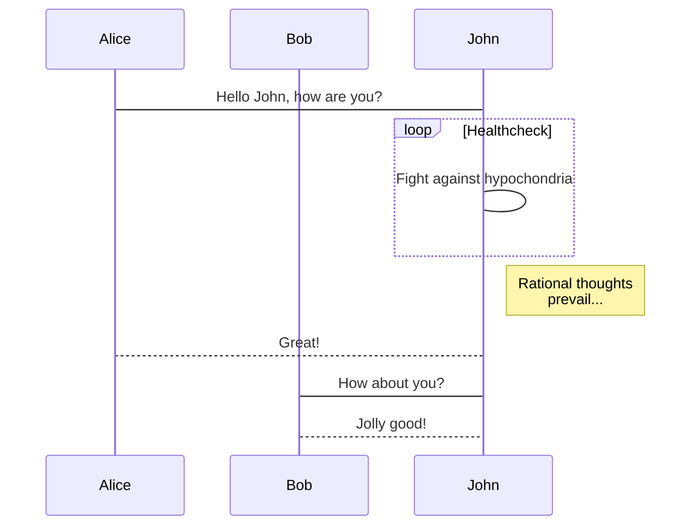

- [模式识别和机器学习](#模式识别和机器学习)
- [- @import '](#--import-)

# 模式识别和机器学习

$a = b+q$
你好- [模式识别和机器学习](#模式识别和机器学习)

# - [@import '](#import-)

｜a｜
a a

* <https://blog.csdn.net/weixin_39278265/article/details/112366908>

niahdi hhh

> `xa adb ja ad`
1.1
  
cifar10 | Column B | Column C
---------|----------|---------
 A1 | B1 | C1
 A2 | B2 | C2
 A3 | B3 | C3

